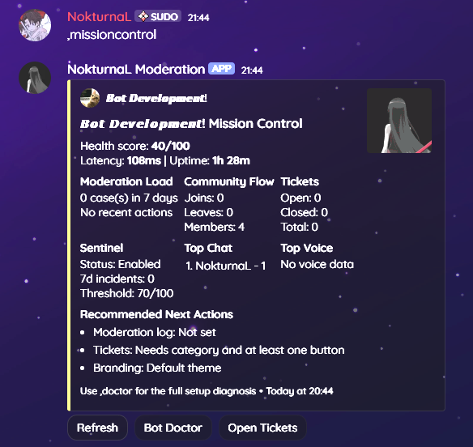
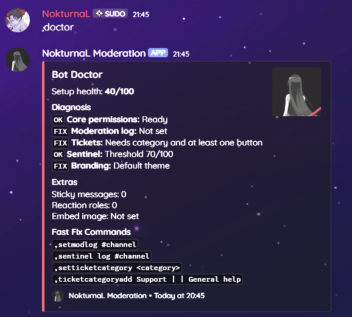
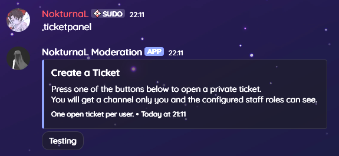
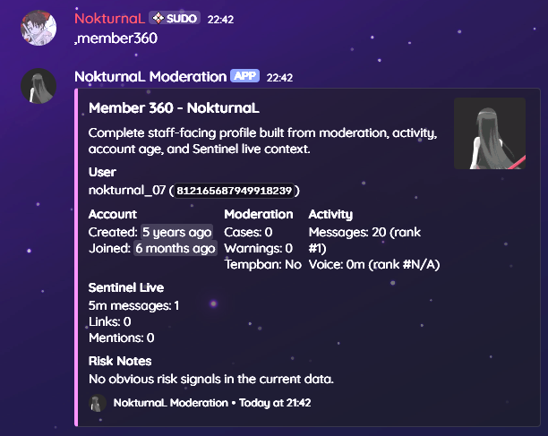
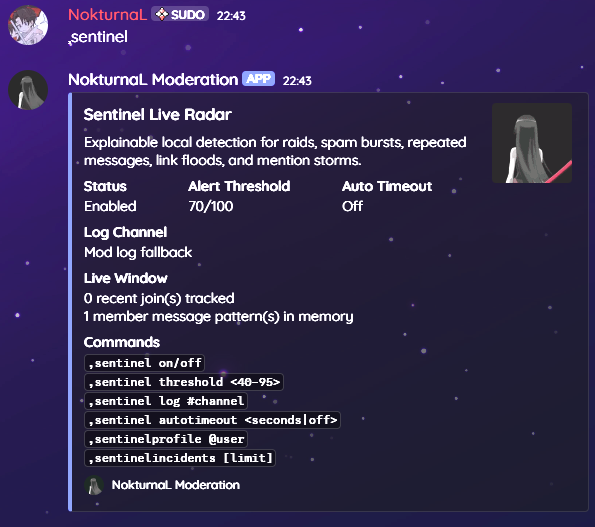

<!--
  ============================================================
    Made by Kieranmcm07 on GitHub
    GitHub: https://github.com/Kieranmcm07
  ============================================================
-->
# Discord Moderation Bot

A practical `discord.py` moderation and server-management bot with SQLite
storage, staff dashboards, tickets, activity tracking, AutoMod, and music tools.

It is built for small and mid-sized Discord servers that want a capable staff
toolkit without needing a separate web dashboard or external database service.

## Features

- Moderation commands for bans, tempbans, softbans, kicks, warnings, timeouts,
  message cleanup, slowmode, and automatic warning escalations
- Case tracking with user history, moderator summaries, CSV exports, case search,
  editable reasons, and follow-up comments
- Mission Control dashboard for server health, moderation load, tickets,
  activity, Sentinel status, and recommended staff actions
- Member 360 profiles that combine account age, moderation history, activity,
  and live Sentinel risk signals
- Bot Doctor setup checks for permissions, logs, tickets, Sentinel, branding,
  and autorole configuration
- Ticket panels with category buttons, private ticket channels, staff roles,
  transcripts, logs, user add/remove controls, and rename support
- Appeal panels for moderation case appeals with private appeal tickets and
  staff decision logging
- AutoMod for blocked terms, Discord invites, external links, mass mentions, and
  optional warning cases
- Sentinel threat radar for explainable raid, spam, link flood, mention storm,
  suspicious join wave, and new-account detection
- Activity tracking for chat and voice with leaderboards and per-user stats
- Invite logging, welcome and leave messages, deleted and edited message audit
  logs, sticky messages, autorole, polls, announcements, channel locks, nickname
  tools, reaction-role buttons, reminders, AFK statuses, custom commands, and
  music playback

## Screenshots

These screenshots are included in the repository under `docs/screenshots/`, so
they render directly on the GitHub project page.

<table>
  <tr>
    <td align="center" width="50%">
      <strong>Mission Control</strong><br>
      
    </td>
    <td align="center" width="50%">
      <strong>Bot Doctor</strong><br>
      
    </td>
  </tr>
  <tr>
    <td align="center" width="50%">
      <strong>Ticket Panel</strong><br>
      
    </td>
    <td align="center" width="50%">
      <strong>Member 360</strong><br>
      
    </td>
  </tr>
  <tr>
    <td align="center" colspan="2">
      <strong>Sentinel</strong><br>
      
    </td>
  </tr>
</table>

## Requirements

- Python 3.10 or newer
- A Discord bot application and token
- Discord privileged intents enabled for:
  - Server Members Intent
  - Message Content Intent
- FFmpeg on your system path if you want to use the music commands

Recommended Discord permissions:

- View Channels
- Send Messages
- Embed Links
- Read Message History
- Manage Messages
- Manage Channels
- Manage Roles
- Manage Nicknames
- Kick Members
- Ban Members
- Moderate Members
- Manage Guild
- View Audit Log

## Setup

1. Clone the repository.

```bash
git clone https://github.com/Kieranmcm07/Discord_Moderation_Bot.git
cd Discord_Moderation_Bot
```

2. Install dependencies.

```bash
pip install -r requirements.txt
```

3. Create your environment file.

```bat
copy .env.example .env
```

4. Fill in `.env`.

```env
BOT_TOKEN=YOUR_BOT_TOKEN_HERE
PREFIX=,
OWNER_IDS=
MOD_LOG_CHANNEL_ID=0
INVITE_LOG_CHANNEL_ID=0
JOIN_LOG_CHANNEL_ID=0
OFFLINE_NOTICE_CHANNEL_ID=0
OFFLINE_NOTICE_MESSAGE=I am going offline because the computer running me is shutting down. Commands will be unavailable until the bot starts again.
OFFLINE_PRESENCE_MESSAGE=Going offline
DB_PATH=data/bot.db
```

Only `BOT_TOKEN` is required. The other values can be left as defaults or
configured later with bot commands.

5. Run the bot.

```bash
py -3 main.py
```

If the Python launcher is not available on your machine, use your normal Python
command instead:

```bash
python main.py
```

## Windows Helper Scripts

The repository includes Windows batch files for common local workflows:

| Script | Purpose |
| --- | --- |
| `start_bot.bat` | Start the bot through the launcher |
| `restart_bot.bat` | Restart the bot |
| `stop_bot.bat` | Stop the running bot process |
| `install_startup.bat` | Add the bot to Windows startup |
| `remove_startup.bat` | Remove the Windows startup entry |

## Configuration

Environment values are loaded from `.env`.

| Variable | Description |
| --- | --- |
| `BOT_TOKEN` | Discord bot token |
| `PREFIX` | Text command prefix, default `,` |
| `OWNER_IDS` | Comma-separated Discord user IDs treated as bot owners |
| `DB_PATH` | SQLite database path, default `data/bot.db` |
| `MOD_LOG_CHANNEL_ID` | Optional fallback moderation log channel |
| `INVITE_LOG_CHANNEL_ID` | Optional invite log channel |
| `JOIN_LOG_CHANNEL_ID` | Optional join and leave log channel |
| `OFFLINE_NOTICE_CHANNEL_ID` | Optional fallback channel for graceful shutdown notices |
| `OFFLINE_NOTICE_MESSAGE` | Message sent before graceful shutdown; supports `{server}` and `{prefix}` |
| `OFFLINE_PRESENCE_MESSAGE` | Temporary presence text used while shutting down |

Most server-specific setup can be managed inside Discord:

```text
,settings
,setmodlog #channel
,setmessagelog #channel
,setofflinechannel #channel
,setwelcomechannel #channel
,setwelcomemessage <message>
,setleavechannel #channel
,setleavemessage <message>
,setembedcolor <hex>
,setembedimage <url>
```

Welcome and leave templates support `{user}`, `{username}`, `{server}`, and
`{count}` placeholders. Custom command responses support `{user}`, `{username}`,
and `{server}`.

## Command Overview

The default prefix in this README is `,`. Change it with `PREFIX` in `.env`.

### Command Center

| Command | Description |
| --- | --- |
| `,missioncontrol` | Open the staff operations dashboard |
| `,dashboard` | Alias for Mission Control |
| `,doctor` | Diagnose permissions and setup gaps |
| `,member360 @user` | Show a complete staff profile for one member |

### Moderation

| Command | Description |
| --- | --- |
| `,ban @user [reason]` | Ban a member |
| `,tempban @user <duration> [reason]` | Ban a member for a limited time |
| `,tempbans` | Show active temporary bans |
| `,unban <user_id> [reason]` | Unban a user by ID |
| `,kick @user [reason]` | Kick a member |
| `,softban @user [days] [reason]` | Ban then unban a member to clear recent messages |
| `,warn @user [reason]` | Warn a member |
| `,warnings @user` | Show active warnings |
| `,clearwarns @user [amount] [reason]` | Remove recent warnings |
| `,note @user <note>` | Add a private moderator note |
| `,timeout @user [duration] [reason]` | Timeout a member |
| `,untimeout @user [reason]` | Remove a timeout |
| `,purge <amount>` | Delete recent messages |
| `,clean <amount> [@user]` | Delete recent messages, optionally from one user |
| `,chatlog [#channel] [amount]` | Export recent messages as a text file |
| `,purgelinks <amount>` | Delete recent messages containing links |
| `,purgebots <amount>` | Delete recent bot messages |
| `,slowmode [seconds]` | Set channel slowmode |
| `,setescalation <warns> <action> [duration]` | Configure automatic warning punishments |
| `,removeescalation <warns>` | Remove an escalation rule |
| `,escalations` | List escalation rules |

### Cases

| Command | Description |
| --- | --- |
| `,case <id>` | Look up one case |
| `,history @user` | Show a user's moderation history |
| `,modsummary @user` | Show a compact moderation summary |
| `,casefile @user [limit]` | Export moderation history as CSV |
| `,recentcases [limit]` | Show recent moderation actions |
| `,searchcases <query>` | Search cases by action or reason |
| `,casecomment <case_id> <note>` | Add a follow-up note |
| `,reason <case_id> <reason>` | Update a case reason |

### Tickets And Appeals

| Command | Description |
| --- | --- |
| `,setticketcategory <category>` | Set the ticket channel category |
| `,setticketlog #channel` | Set the ticket log channel |
| `,ticketroleadd <role>` | Allow a role to access tickets |
| `,ticketroleremove <role>` | Remove a ticket staff role |
| `,ticketroles` | Show ticket staff roles |
| `,ticketcategoryadd Name \| Emoji \| Description` | Add a ticket type |
| `,ticketcategoryremove <id>` | Remove a ticket type |
| `,ticketcategories` | List ticket types |
| `,ticketpanel [#channel]` | Post the ticket panel |
| `,ticketsettings` | Show ticket settings |
| `,ticketadd @user` | Add a user to the ticket |
| `,ticketremove @user` | Remove a user from the ticket |
| `,ticketrename <name>` | Rename the current ticket channel |
| `,closeticket` | Close the current ticket |
| `,appealpanel [#channel]` | Post the case appeal panel |
| `,appeal accept <note>` | Accept the current appeal |
| `,appeal deny <note>` | Deny the current appeal |
| `,appeal close` | Close the current appeal ticket |

### AutoMod And Sentinel

| Command | Description |
| --- | --- |
| `,automod` | Show AutoMod settings |
| `,automod on/off` | Enable or disable AutoMod |
| `,automod invites on/off` | Delete Discord invite links |
| `,automod links on/off` | Delete external links |
| `,automod mentions <number\|off>` | Set the mass mention threshold |
| `,automod warn on/off` | Add warning cases when AutoMod deletes |
| `,automod addword <term>` | Add a blocked word or phrase |
| `,automod removeword <term>` | Remove a blocked word or phrase |
| `,automod words` | List blocked terms |
| `,sentinel` | Show the live threat radar panel |
| `,sentinel on/off` | Enable or disable Sentinel |
| `,sentinel threshold <40-95>` | Set the alert risk score |
| `,sentinel log #channel` | Set the Sentinel alert channel |
| `,sentinel autotimeout <seconds\|off>` | Auto-timeout high-risk users |
| `,sentinelprofile @user` | Show a member's live behaviour profile |
| `,sentinelincidents [limit]` | Show recent Sentinel incidents |

### Server Management

| Command | Description |
| --- | --- |
| `,serverinfo` | Show server details |
| `,userinfo [@user]` | Show user details |
| `,avatar [@user]` | Show a user's avatar |
| `,roleinfo <role>` | Show role details |
| `,announce #channel <message>` | Send an announcement embed |
| `,poll Question \| Option 1 \| Option 2` | Create a reaction poll |
| `,lock [#channel] [reason]` | Lock a channel |
| `,unlock [#channel] [reason]` | Unlock a channel |
| `,nick @user <nickname>` | Change a member's nickname |
| `,resetnick @user` | Reset a nickname |
| `,setautorole <role>` | Set the automatic join role |
| `,autorole` | View the current autorole |
| `,clearautorole` | Disable autorole |
| `,setsticky [#channel] <message>` | Set a sticky message |
| `,sticky [#channel]` | View a sticky message |
| `,stickies` | List sticky messages |
| `,clearsticky [#channel]` | Remove a sticky message |
| `,botinfo` | Show bot stats |

### Configuration

| Command | Description |
| --- | --- |
| `,settings` | Show server configuration |
| `,setwelcomechannel #channel` | Set the welcome channel |
| `,setwelcomemessage <message>` | Set the welcome template |
| `,setleavechannel #channel` | Set the leave channel |
| `,setleavemessage <message>` | Set the leave template |
| `,setembedcolor <hex>` | Set the default embed color |
| `,setembedimage <url>` | Set a shared embed image or GIF |
| `,clearembedimage` | Remove the shared embed image |
| `,setmodlog #channel` | Set moderation action logs |
| `,viewmodlog` | Show the moderation log channel |
| `,clearmodlog` | Disable moderation action logs |
| `,setmessagelog #channel` | Set deleted and edited message audit logs |
| `,viewmessagelog` | Show the message audit log channel |
| `,clearmessagelog` | Disable message audit logs |
| `,setofflinechannel #channel` | Set graceful shutdown notices |
| `,viewofflinechannel` | Show the graceful shutdown notice channel |
| `,clearofflinechannel` | Disable graceful shutdown notices |

### Community Tools

| Command | Description |
| --- | --- |
| `,topchat [limit]` | Show top message senders |
| `,topvoice [limit]` | Show top voice users |
| `,stats [@user]` | Show activity stats |
| `,rradd @role [Label \| Emoji]` | Add or update a reaction-role option |
| `,rrremove @role` | Remove a reaction-role option |
| `,rrlist` | List reaction roles |
| `,rrpanel [#channel]` | Post the role button panel |
| `,remind <time> <text>` | Create a reminder |
| `,reminders` | List your reminders |
| `,delreminder <id>` | Delete a reminder |
| `,afk [reason]` | Mark yourself AFK |
| `,customadd <name> <response>` | Add or update a custom command |
| `,customremove <name>` | Remove a custom command |
| `,customlist` | List custom commands |
| `,invites` | Show active server invites |

### Music

| Command | Description |
| --- | --- |
| `,join` | Join your current voice channel |
| `,play <url or search>` | Play audio from a URL or search term |
| `,queue` | Show the queue |
| `,controls` | Show interactive music controls |
| `,skip` | Skip the current track |
| `,pause` | Pause playback |
| `,resume` | Resume playback |
| `,loop [on/off]` | Repeat the current track |
| `,shuffle` | Shuffle queued tracks |
| `,remove <position>` | Remove a queued track |
| `,move <from> <to>` | Move a queued track |
| `,jump <position>` | Skip ahead to a queued track |
| `,replay` | Restart the current track |
| `,volume [0-200]` | Show or set playback volume |
| `,filters` | List available audio filters |
| `,filter <name>` | Apply an audio filter |
| `,bassboost` | Turn on bass boost |
| `,chipmunk` | Turn on the chipmunk filter |
| `,stop` | Stop playback and clear the queue |
| `,leave` | Leave the current voice channel |
| `,nowplaying` | Show the current track |

### Fun And Utility

| Command | Description |
| --- | --- |
| `,help [command]` | Show grouped help or details for one command |
| `,help search <word>` | Search commands |
| `,ping` | Check websocket latency |
| `,about` | Show project and creator links |
| `,8ball <question>` | Ask the magic 8-ball a question |
| `,coinflip` | Flip a coin |
| `,roll [max]` | Roll a number |
| `,choose Option 1 \| Option 2` | Choose between options |
| `,joke` | Tell a clean joke |
| `,meme [top \| bottom]` | Post a generated meme image |
| `,ship @user1 @user2` | Generate a fun ship score |

## Data And Behaviour Notes

- The bot stores local data in SQLite, by default at `data/bot.db`.
- Temporary bans are checked and lifted in the background while the bot is
  online.
- Reminders are stored in SQLite and still deliver after restarts once due.
- Durations support compact and readable formats such as `30m`, `1h30m`,
  `2 hours`, and `7d`.
- Sentinel stores incident metadata, not full message content.
- Voice activity tracking only records time while the bot is running.
- Guilds can set a custom embed color and an optional shared image or GIF for
  branded embeds.
- If `stop_bot.bat` or a normal graceful exit is used, the bot can post an
  offline notice before disconnecting. Once it is fully offline, Discord cannot
  deliver commands to it, so it cannot reply until it starts again.

## Project Structure

```text
.
|-- cogs/
|   |-- activity.py
|   |-- afk.py
|   |-- appeals.py
|   |-- automod.py
|   |-- cases.py
|   |-- command_center.py
|   |-- configuration.py
|   |-- custom_commands.py
|   |-- fun.py
|   |-- help.py
|   |-- invite_logger.py
|   |-- message_audit.py
|   |-- moderation.py
|   |-- music.py
|   |-- reaction_roles.py
|   |-- reminders.py
|   |-- server_management.py
|   |-- sentinel.py
|   |-- tickets.py
|   `-- utility.py
|-- data/
|-- docs/
|   `-- screenshots/
|-- utils/
|   |-- db.py
|   `-- embeds.py
|-- .env.example
|-- config.py
|-- launcher.py
|-- main.py
`-- requirements.txt
```

## License

This project is licensed under the MIT License.
