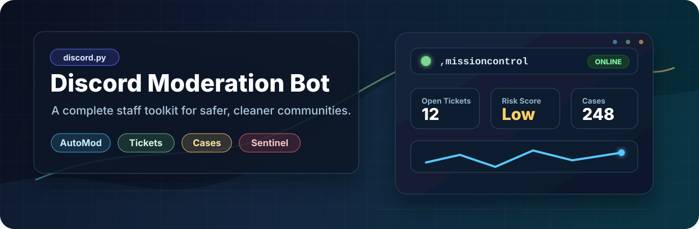
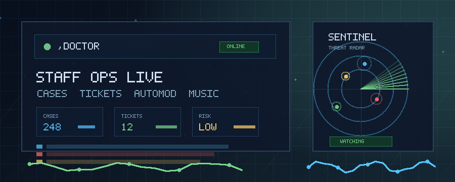

<!--
  ============================================================
    Made by Kieranmcm07 on GitHub
    GitHub: https://github.com/Kieranmcm07
  ============================================================
-->

<p align="center">
  
</p>

<h1 align="center">Discord Moderation Bot</h1>

<p align="center">
  A polished <code>discord.py</code> staff toolkit for keeping Discord communities cleaner,
  calmer, and easier to run.
  <br>
  Moderation, tickets, activity tracking, AutoMod, Sentinel, setup checks, and music tools
  all live inside Discord.
</p>

<p align="center">
  <a href="https://github.com/Kieranmcm07/Discord_Moderation_Bot/releases">
    
  </a>
  <a href="LICENSE">
    
  </a>
  
  
  
</p>

<p align="center">
  <a href="#staff-workflow">Workflow</a>
  |
  <a href="#features">Features</a>
  |
  <a href="#screenshots">Screenshots</a>
  |
  <a href="#setup">Setup</a>
  |
  <a href="#command-overview">Commands</a>
  |
  <a href="#configuration">Configuration</a>
</p>

<p align="center">
  
</p>

<p align="center">
  <strong>Built for busy staff teams:</strong>
  diagnose setup issues, handle incidents, open tickets, review cases, watch risk signals,
  and keep community extras in one bot without a separate web dashboard.
</p>

> Tip: after inviting the bot, run `,doctor` in a server channel to check
> permissions, logging channels, and setup gaps before staff start using it.

## Staff Workflow

<table>
  <tr>
    <td width="33%" align="center">
      <strong>1. Check The Setup</strong><br>
      Run <code>,doctor</code> to catch missing permissions, channel gaps, and setup issues
      before staff need the bot under pressure.
    </td>
    <td width="33%" align="center">
      <strong>2. Work From Mission Control</strong><br>
      Use <code>,missioncontrol</code> for server health, open tickets, moderation load,
      activity signals, and suggested next actions.
    </td>
    <td width="33%" align="center">
      <strong>3. Respond With Context</strong><br>
      Pull <code>,member360</code>, case history, Sentinel signals, chat logs, and tickets
      into the same staff workflow.
    </td>
  </tr>
</table>

## At A Glance

<table>
  <tr>
    <td width="25%" align="center">
      <strong>Command Center</strong><br>
      Mission Control, Bot Doctor, setup checks, server health, and staff prompts.
    </td>
    <td width="25%" align="center">
      <strong>Case Engine</strong><br>
      Warnings, bans, timeouts, notes, chat logs, escalation rules, and CSV exports.
    </td>
    <td width="25%" align="center">
      <strong>Safety Automation</strong><br>
      AutoMod, Sentinel risk signals, invite logging, autoroles, and sticky messages.
    </td>
    <td width="25%" align="center">
      <strong>Community Layer</strong><br>
      Tickets, appeals, reminders, AFK, reaction roles, custom commands, and music.
    </td>
  </tr>
</table>

## Features

<table>
  <tr>
    <td width="50%">
      <strong>Complete moderation workflow</strong><br>
      Ban, tempban, softban, kick, warn, timeout, clean messages, slowmode, add private notes,
      export chat logs, and configure automatic warning escalations.
    </td>
    <td width="50%">
      <strong>Case history that staff can actually use</strong><br>
      Search cases, edit reasons, add follow-up comments, view recent actions, build compact
      moderator summaries, and export case files as CSV.
    </td>
  </tr>
  <tr>
    <td width="50%">
      <strong>Mission Control dashboard</strong><br>
      See server health, moderation load, open tickets, activity, Sentinel status, and suggested
      staff actions from inside Discord.
    </td>
    <td width="50%">
      <strong>Member 360 profiles</strong><br>
      Combine account age, moderation history, chat activity, voice time, and live Sentinel risk
      signals into one staff-friendly view.
    </td>
  </tr>
  <tr>
    <td width="50%">
      <strong>Tickets and appeals</strong><br>
      Build ticket panels with category buttons, private channels, staff roles, transcripts,
      logs, user controls, renaming, and moderation appeal decisions.
    </td>
    <td width="50%">
      <strong>AutoMod and Sentinel</strong><br>
      Block terms, delete invites and links, detect mass mentions, spot spam, link floods,
      suspicious join waves, and new-account risk.
    </td>
  </tr>
  <tr>
    <td width="50%">
      <strong>Server management tools</strong><br>
      Welcome and leave messages, invite logs, deleted and edited message audits, polls,
      announcements, locks, nicknames, autoroles, and branded embeds.
    </td>
    <td width="50%">
      <strong>Community extras</strong><br>
      Activity leaderboards, reminders, AFK statuses, reaction-role buttons, custom commands,
      fun commands, and music playback with queues and filters.
    </td>
  </tr>
</table>

## Screenshots

These screenshots live in `docs/screenshots/`, so they render directly on the
GitHub project page.

<table>
  <tr>
    <td align="center" width="50%">
      <strong>Mission Control</strong><br><br>
      
    </td>
    <td align="center" width="50%">
      <strong>Bot Doctor</strong><br><br>
      
    </td>
  </tr>
  <tr>
    <td align="center" width="50%">
      <strong>Ticket Panel</strong><br><br>
      
    </td>
    <td align="center" width="50%">
      <strong>Member 360</strong><br><br>
      
    </td>
  </tr>
  <tr>
    <td align="center" colspan="2">
      <strong>Sentinel Threat Radar</strong><br><br>
      
    </td>
  </tr>
</table>

## Requirements

- Python 3.10 or newer
- A Discord bot application and token
- Discord privileged intents enabled for:
  - Server Members Intent
  - Message Content Intent
- FFmpeg on your system path if you want to use the music commands
- Optional Spotify developer app credentials if you want `,play` to accept
  Spotify track, album, and playlist links

Recommended Discord permissions:

- View Channels
- Send Messages
- Embed Links
- Read Message History
- Manage Messages
- Manage Channels
- Manage Roles
- Manage Nicknames
- Kick Members
- Ban Members
- Moderate Members
- Manage Guild
- View Audit Log

## Setup

1. Clone the repository.

```bash
git clone https://github.com/Kieranmcm07/Discord_Moderation_Bot.git
cd Discord_Moderation_Bot
```

2. Install dependencies.

```bash
pip install -r requirements.txt
```

3. Create your environment file.

```bat
copy .env.example .env
```

4. Fill in `.env`.

```env
BOT_TOKEN=YOUR_BOT_TOKEN_HERE
PREFIX=,
BOT_VERSION=v1.2.0
PRESENCE_ROTATION_SECONDS=45
OWNER_IDS=
MOD_LOG_CHANNEL_ID=0
INVITE_LOG_CHANNEL_ID=0
JOIN_LOG_CHANNEL_ID=0
DB_PATH=data/bot.db
SPOTIFY_CLIENT_ID=
SPOTIFY_CLIENT_SECRET=
SPOTIFY_MAX_TRACKS=50
SPOTIFY_MARKET=US
YOUTUBE_MAX_TRACKS=50
BOT_FAILURE_MODE=retry
BOT_RETRY_DELAY_SECONDS=5
```

Only `BOT_TOKEN` is required. Spotify values are only needed for Spotify music
links. The other values can be left as defaults or configured later with bot
commands.

5. Run the bot.

```bash
py -3 main.py
```

If the Python launcher is not available on your machine, use your normal Python
command instead:

```bash
python main.py
```

### Optional Spotify Music Links

To use Spotify URLs with `,play`, create a Spotify app in the Spotify Developer
Dashboard and copy its Client ID and Client Secret into `.env`:

```env
SPOTIFY_CLIENT_ID=your_client_id
SPOTIFY_CLIENT_SECRET=your_client_secret
SPOTIFY_MAX_TRACKS=50
SPOTIFY_MARKET=US
YOUTUBE_MAX_TRACKS=50
```

Supported inputs:

- `https://open.spotify.com/track/...`
- `https://open.spotify.com/album/...`
- `https://open.spotify.com/playlist/...`
- `spotify:track:...`, `spotify:album:...`, and `spotify:playlist:...`

Spotify is used for metadata only. The bot reads the Spotify title/artist list,
then searches for a playable audio match through the existing `yt-dlp` music
flow. `SPOTIFY_MAX_TRACKS` caps album and playlist expansion between 1 and 100
tracks so a very large playlist does not lock up the music command.
`SPOTIFY_MARKET` controls the country used for Spotify availability checks;
use `GB` instead of `US` if you want UK availability.

YouTube playlist URLs also work with `,play`. `YOUTUBE_MAX_TRACKS` caps YouTube
playlist expansion between 1 and 100 videos so very large playlists do not lock
up the music command.

## Windows Helper Scripts

The repository includes Windows batch files for common local workflows:

| Script | Purpose |
| --- | --- |
| `start_bot.bat` | Start the bot through the launcher |
| `restart_bot.bat` | Restart the bot |
| `stop_bot.bat` | Stop the running bot process |
| `install_startup.bat` | Add the bot to Windows startup |
| `remove_startup.bat` | Remove the Windows startup entry |

When failure handling is set to `retry`, unexpected top-level crashes are
retried after 5 seconds by default. During launcher startup retries, press `C`
to close instead.

## Configuration

Environment values are loaded from `.env`.

| Variable | Description |
| --- | --- |
| `BOT_TOKEN` | Discord bot token |
| `PREFIX` | Text command prefix, default `,` |
| `BOT_VERSION` | Version text shown in the rotating Discord status |
| `PRESENCE_ROTATION_SECONDS` | Seconds between rotating status updates, minimum `30` |
| `OWNER_IDS` | Comma-separated Discord user IDs treated as bot owners |
| `DB_PATH` | SQLite database path, default `data/bot.db` |
| `BOT_FAILURE_MODE` | `retry` to restart after unexpected failures, or `close` to exit |
| `BOT_RETRY_DELAY_SECONDS` | Seconds to wait before retrying, default `5` |
| `YOUTUBE_MAX_TRACKS` | Maximum YouTube playlist videos to load, capped from `1` to `100` |
| `MOD_LOG_CHANNEL_ID` | Optional fallback moderation log channel |
| `INVITE_LOG_CHANNEL_ID` | Optional invite log channel |
| `JOIN_LOG_CHANNEL_ID` | Optional join and leave log channel |

Most server-specific setup can be managed inside Discord:

```text
,settings
,setmodlog #channel
,setmessagelog #channel
,setwelcomechannel #channel
,setwelcomemessage <message>
,setleavechannel #channel
,setleavemessage <message>
,setembedcolor <hex>
,setembedimage <url>
```

Welcome and leave templates support `{user}`, `{username}`, `{server}`, and
`{count}` placeholders. Custom command responses support `{user}`, `{username}`,
and `{server}`.

## Command Overview

The default prefix in this README is `,`. Change it with `PREFIX` in `.env`.

### Command Center

| Command | Description |
| --- | --- |
| `,missioncontrol` | Open the staff operations dashboard |
| `,dashboard` | Alias for Mission Control |
| `,doctor` | Diagnose permissions and setup gaps |
| `,member360 @user` | Show a complete staff profile for one member |

### Moderation

| Command | Description |
| --- | --- |
| `,ban @user [reason]` | Ban a member |
| `,tempban @user <duration> [reason]` | Ban a member for a limited time |
| `,tempbans` | Show active temporary bans |
| `,unban <user_id> [reason]` | Unban a user by ID |
| `,kick @user [reason]` | Kick a member |
| `,softban @user [days] [reason]` | Ban then unban a member to clear recent messages |
| `,warn @user [reason]` | Warn a member |
| `,warnings @user` | Show active warnings |
| `,clearwarns @user [amount] [reason]` | Remove recent warnings |
| `,note @user <note>` | Add a private moderator note |
| `,timeout @user [duration] [reason]` | Timeout a member |
| `,untimeout @user [reason]` | Remove a timeout |
| `,purge <amount>` | Delete recent messages |
| `,clean <amount> [@user]` | Delete recent messages, optionally from one user |
| `,chatlog [#channel] [amount]` | Export recent messages as a text file |
| `,purgelinks <amount>` | Delete recent messages containing links |
| `,purgebots <amount>` | Delete recent bot messages |
| `,slowmode [seconds]` | Set channel slowmode |
| `,setescalation <warns> <action> [duration]` | Configure automatic warning punishments |
| `,removeescalation <warns>` | Remove an escalation rule |
| `,escalations` | List escalation rules |

### Cases

| Command | Description |
| --- | --- |
| `,case <id>` | Look up one case |
| `,history @user` | Show a user's moderation history |
| `,modsummary @user` | Show a compact moderation summary |
| `,casefile @user [limit]` | Export moderation history as CSV |
| `,recentcases [limit]` | Show recent moderation actions |
| `,searchcases <query>` | Search cases by action or reason |
| `,casecomment <case_id> <note>` | Add a follow-up note |
| `,reason <case_id> <reason>` | Update a case reason |

### Tickets And Appeals

| Command | Description |
| --- | --- |
| `,setticketcategory <category>` | Set the ticket channel category |
| `,setticketlog #channel` | Set the ticket log channel |
| `,ticketroleadd <role>` | Allow a role to access tickets |
| `,ticketroleremove <role>` | Remove a ticket staff role |
| `,ticketroles` | Show ticket staff roles |
| `,ticketcategoryadd Name \| Emoji \| Description` | Add a ticket type |
| `,ticketcategoryremove <id>` | Remove a ticket type |
| `,ticketcategories` | List ticket types |
| `,ticketpanel [#channel]` | Post the ticket panel |
| `,ticketsettings` | Show ticket settings |
| `,ticketadd @user` | Add a user to the ticket |
| `,ticketremove @user` | Remove a user from the ticket |
| `,ticketrename <name>` | Rename the current ticket channel |
| `,closeticket` | Close the current ticket |
| `,appealpanel [#channel]` | Post the case appeal panel |
| `,appeal accept <note>` | Accept the current appeal |
| `,appeal deny <note>` | Deny the current appeal |
| `,appeal close` | Close the current appeal ticket |

### AutoMod And Sentinel

| Command | Description |
| --- | --- |
| `,automod` | Show AutoMod settings |
| `,automod on/off` | Enable or disable AutoMod |
| `,automod invites on/off` | Delete Discord invite links |
| `,automod links on/off` | Delete external links |
| `,automod mentions <number\|off>` | Set the mass mention threshold |
| `,automod warn on/off` | Add warning cases when AutoMod deletes |
| `,automod addword <term>` | Add a blocked word or phrase |
| `,automod removeword <term>` | Remove a blocked word or phrase |
| `,automod words` | List blocked terms |
| `,sentinel` | Show the live threat radar panel |
| `,sentinel on/off` | Enable or disable Sentinel |
| `,sentinel threshold <40-95>` | Set the alert risk score |
| `,sentinel log #channel` | Set the Sentinel alert channel |
| `,sentinel autotimeout <seconds\|off>` | Auto-timeout high-risk users |
| `,sentinelprofile @user` | Show a member's live behaviour profile |
| `,sentinelincidents [limit]` | Show recent Sentinel incidents |

### Server Management

| Command | Description |
| --- | --- |
| `,serverinfo` | Show server details |
| `,userinfo [@user]` | Show user details |
| `,avatar [@user]` | Show a user's avatar |
| `,roleinfo <role>` | Show role details |
| `,announce #channel <message>` | Send an announcement embed |
| `,poll Question \| Option 1 \| Option 2` | Create a reaction poll |
| `,lock [#channel] [reason]` | Lock a channel |
| `,unlock [#channel] [reason]` | Unlock a channel |
| `,nick @user <nickname>` | Change a member's nickname |
| `,resetnick @user` | Reset a nickname |
| `,setautorole <role>` | Set the automatic join role |
| `,autorole` | View the current autorole |
| `,clearautorole` | Disable autorole |
| `,setsticky [#channel] <message>` | Set a sticky message |
| `,sticky [#channel]` | View a sticky message |
| `,stickies` | List sticky messages |
| `,clearsticky [#channel]` | Remove a sticky message |
| `,botinfo` | Show bot stats |

### Configuration

| Command | Description |
| --- | --- |
| `,settings` | Show server configuration |
| `,setwelcomechannel #channel` | Set the welcome channel |
| `,setwelcomemessage <message>` | Set the welcome template |
| `,setleavechannel #channel` | Set the leave channel |
| `,setleavemessage <message>` | Set the leave template |
| `,setembedcolor <hex>` | Set the default embed color |
| `,setembedimage <url>` | Set a shared embed image or GIF |
| `,clearembedimage` | Remove the shared embed image |
| `,setmodlog #channel` | Set moderation action logs |
| `,viewmodlog` | Show the moderation log channel |
| `,clearmodlog` | Disable moderation action logs |
| `,setmessagelog #channel` | Set deleted and edited message audit logs |
| `,viewmessagelog` | Show the message audit log channel |
| `,clearmessagelog` | Disable message audit logs |

### Community Tools

| Command | Description |
| --- | --- |
| `,topchat [limit]` | Show top message senders |
| `,topvoice [limit]` | Show top voice users |
| `,stats [@user]` | Show activity stats |
| `,rradd @role [Label \| Emoji]` | Add or update a reaction-role option |
| `,rrremove @role` | Remove a reaction-role option |
| `,rrlist` | List reaction roles |
| `,rrpanel [#channel]` | Post the role button panel |
| `,remind <time> <text>` | Create a reminder |
| `,reminders` | List your reminders |
| `,delreminder <id>` | Delete a reminder |
| `,afk [reason]` | Mark yourself AFK |
| `,customadd <name> <response>` | Add or update a custom command |
| `,customremove <name>` | Remove a custom command |
| `,customlist` | List custom commands |
| `,invites` | Show active server invites |

### Music

| Command | Description |
| --- | --- |
| `,join` | Join your current voice channel |
| `,play <url, search, Spotify, or YouTube playlist>` | Play audio from a URL, search term, Spotify link, or YouTube playlist |
| `,queue` | Show the queue |
| `,controls` | Show interactive music controls |
| `,skip` | Skip the current track |
| `,pause` | Pause playback |
| `,resume` | Resume playback |
| `,loop [on/off]` | Repeat the current track |
| `,shuffle` | Shuffle queued tracks |
| `,remove <position>` | Remove a queued track |
| `,move <from> <to>` | Move a queued track |
| `,jump <position>` | Skip ahead to a queued track |
| `,replay` | Restart the current track |
| `,volume [0-200]` | Show or set playback volume |
| `,filters` | List available audio filters |
| `,filter <name>` | Apply an audio filter |
| `,bassboost` | Turn on bass boost |
| `,chipmunk` | Turn on the chipmunk filter |
| `,stop` | Stop playback and clear the queue |
| `,leave` | Leave the current voice channel |
| `,nowplaying` | Show the current track |

### Fun And Utility

| Command | Description |
| --- | --- |
| `,help [command]` | Show grouped help or details for one command |
| `,help search <word>` | Search commands |
| `,ping` | Check websocket latency |
| `,about` | Show project and creator links |
| `,8ball <question>` | Ask the magic 8-ball a question |
| `,coinflip` | Flip a coin |
| `,roll [max]` | Roll a number |
| `,choose Option 1 \| Option 2` | Choose between options |
| `,joke` | Tell a clean joke |
| `,meme [top \| bottom]` | Post a generated meme image |
| `,ship @user1 @user2` | Generate a fun ship score |

## Data And Behaviour Notes

- The bot stores local data in SQLite, by default at `data/bot.db`.
- Temporary bans are checked and lifted in the background while the bot is
  online.
- Reminders are stored in SQLite and still deliver after restarts once due.
- Durations support compact and readable formats such as `30m`, `1h30m`,
  `2 hours`, and `7d`.
- Sentinel stores incident metadata, not full message content.
- Voice activity tracking only records time while the bot is running.
- Guilds can set a custom embed color and an optional shared image or GIF for
  branded embeds.
- Once the bot is fully offline, Discord cannot deliver commands to it, so it
  cannot reply until it starts again.

## Project Structure

```text
.
|-- cogs/
|   |-- activity.py
|   |-- afk.py
|   |-- appeals.py
|   |-- automod.py
|   |-- cases.py
|   |-- command_center.py
|   |-- configuration.py
|   |-- custom_commands.py
|   |-- fun.py
|   |-- help.py
|   |-- invite_logger.py
|   |-- message_audit.py
|   |-- moderation.py
|   |-- music.py
|   |-- reaction_roles.py
|   |-- reminders.py
|   |-- server_management.py
|   |-- sentinel.py
|   |-- tickets.py
|   `-- utility.py
|-- data/
|-- docs/
|   |-- assets/
|   |   |-- readme-banner.svg
|   |   `-- readme-moderation-loop.gif
|   `-- screenshots/
|-- tests/
|-- utils/
|   |-- db.py
|   |-- embeds.py
|   |-- errors.py
|   `-- time.py
|-- .env.example
|-- config.py
|-- launcher.py
|-- main.py
`-- requirements.txt
```

## License

This project is licensed under the MIT License.
